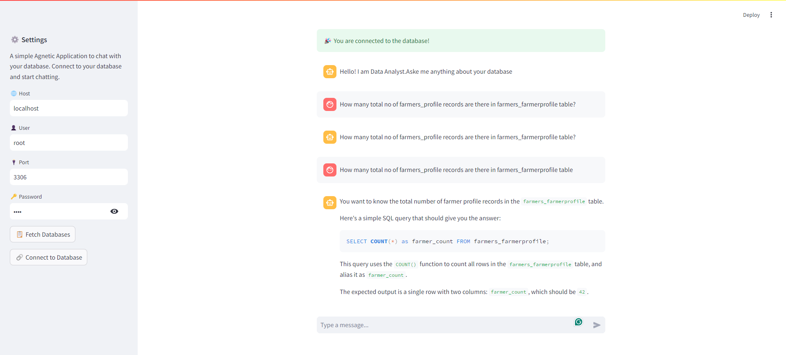

# 💬 Chat with Your Database

This is a Streamlit-based application that allows users to interact with a database by chatting with an AI model. It helps users generate SQL queries based on natural language input and provides natural language responses based on the SQL query results. The app is integrated with Langchain's `ChatOllama` Llama 3.1 8b model and uses MySQL to perform database operations.

## ⚡ Features
- 🖥️ **Connect to a database**: Enter your host, user, password, and port to establish a connection.
- 💬 **Chat-based interface**: Ask questions in plain English and receive SQL queries as responses.
- 🛠️ **SQL generation**: Automatically generates SQL queries based on the schema of the connected database.
- 🔍 **Natural language responses**: Returns results from the database in an easy-to-understand format.

## 📦 Installation

1. Clone the repository:
   ```bash
   git clone https://github.com/Aman9868/SQL-AI-Agents-Streamlit-App.git
   ```
2. Create New Python Environment & Activate

```bash
   virtualenv <your environment>
   source <your environment>/bin/activate
```
3. Install Dependencies

```bash
   pip install -r requirements.txt
```

4. Run APP

To launch the Streamlit app, run the following command in your terminal:
```bash
   streamlit run src/chain.py
```

# 🚀 Usage
Database Connection:

In the sidebar, enter the following details to connect to your database:

- 🌐 Host
- 👤 User
- 🔑 Password
- 🔌 Port
Click 📋 Fetch Databases to retrieve available databases from the server and select one from the dropdown list. Click 🔗 Connect to Database to connect.

- Chat with the Database:
 Once connected, you can start asking questions about the database schema and data. The application will convert your natural language input into SQL queries and execute them on the connected database.

- Conversation History:
 The conversation history between you and the AI is displayed in the chat interface. Both user queries and AI-generated responses are shown.

# 🖼️ Demo
 Here’s a demo of the application in action:

 In this example, the user connects to a  database named `agrisarathi`, asks questions, and receives both SQL queries and natural language responses from the AI.




# 🧑‍💻 Key Components
- get_database_names()
  Fetches and returns a list of available databases from the MySQL server.

- start_database()
  Establishes a connection with the selected database using MySQL connector and returns a SQLDatabase object.

- get_sqlchain()
  Generates a Langchain SQL query based on user input and database schema.

- get_response()
 Handles generating the SQL query, running it, and converting the result into a natural language response.

# 🎨 Streamlit Chat Interface
Displays the conversation history and allows users to type new messages.

# 📋 Dependencies
- Streamlit
- Langchain
- MySQL Connector
- Python-dotenv
- Ollama Model (Llama3.1 8b)

# 🔮 Future Enhancements
-Extend support for more databases like PostgreSQL.
-Add more language models for different types of queries.
Integrate authentication mechanisms for secure access to databases.

# 📄 License
This project is licensed under the MIT License.